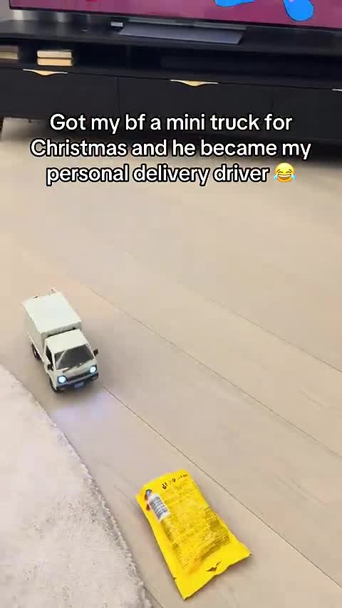
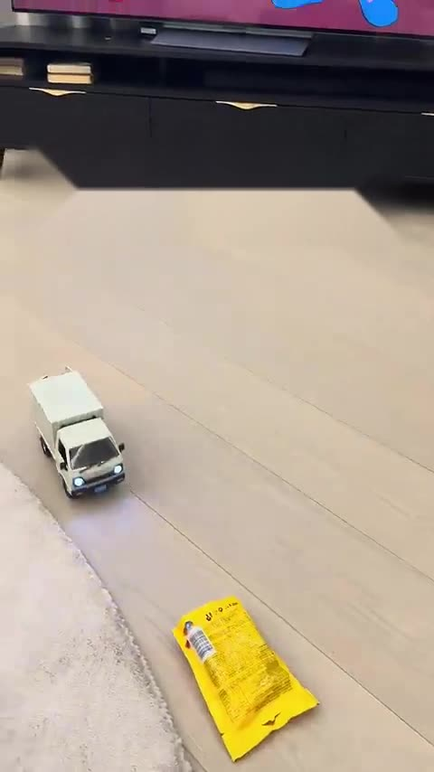

# Subtitle Remover

AI-powered video subtitle removal using YOLO object detection and advanced inpainting techniques.

[](https://replicate.com/hjunior29/video-text-remover)

## Overview

This model automatically detects and removes hardcoded subtitles from videos using a combination of YOLO (You Only Look Once) object detection and context-aware inpainting algorithms. It preserves video quality while seamlessly removing text overlays, making it ideal for content repurposing, localization, and accessibility improvements.

### Example Results

<div align="center">


*Side-by-side comparison: Original with text (left) vs. Processed without text (right)*

</div>

<details>
<summary>📸 Click to see static comparison</summary>

| Original (with text) | Processed (text removed) |
|----------------------|--------------------------|
|  |  |

</details>

## Features

- **AI-Powered Detection**: Uses a trained YOLO model to accurately identify subtitle regions
- **Multiple Removal Methods**: Choose from 6 different algorithms optimized for different use cases
- **High Quality Output**: Maintains video quality with H.264 encoding and configurable quality settings
- **Flexible Configuration**: Fine-tune detection sensitivity, region margins, and removal methods
- **Batch Processing**: Efficiently processes entire videos frame-by-frame
- **Production Ready**: Deployed on Replicate for easy API access

## How to Use

### Option 1: Replicate Web Interface

Visit [replicate.com/hjunior29/video-text-remover](https://replicate.com/hjunior29/video-text-remover) and upload your video.

### Option 2: API Integration

#### Python

```python
import replicate

output = replicate.run(
    "hjunior29/video-text-remover",
    input={
        "video": open("video_with_subtitles.mp4", "rb"),
        "method": "hybrid",
        "conf_threshold": 0.25,
        "margin": 5
    }
)
print(output)
```

#### cURL

```bash
curl -X POST https://api.replicate.com/v1/predictions \
  -H "Authorization: Bearer $REPLICATE_API_TOKEN" \
  -H "Content-Type: application/json" \
  -d '{
    "version": "YOUR_MODEL_VERSION",
    "input": {
      "video": "https://example.com/video.mp4",
      "method": "hybrid",
      "conf_threshold": 0.25,
      "margin": 5
    }
  }'
```

#### Node.js

```javascript
import Replicate from "replicate";

const replicate = new Replicate({
  auth: process.env.REPLICATE_API_TOKEN,
});

const output = await replicate.run(
  "hjunior29/video-text-remover",
  {
    input: {
      video: "https://example.com/video.mp4",
      method: "hybrid",
      conf_threshold: 0.25,
      margin: 5
    }
  }
);
console.log(output);
```

### Option 3: Local Deployment

#### Prerequisites

- Python 3.12+
- FFmpeg
- Docker (for Cog deployment)

#### Installation

```bash
# Clone repository
git clone https://github.com/yourusername/video-text-remover.git
cd video-text-remover

# Install dependencies
pip install -r requirements.txt

# Install Cog
curl -o /usr/local/bin/cog -L https://github.com/replicate/cog/releases/latest/download/cog_`uname -s`_`uname -m`
chmod +x /usr/local/bin/cog

# Run locally
cog predict -i video=@input_video.mp4 -i method=hybrid
```

## Input Parameters

### `video` (required)
- **Type**: Video file
- **Supported formats**: MP4, AVI, MOV, and other common formats
- **Description**: Input video containing hardcoded subtitles to remove

### `method` (optional)
- **Type**: String (choice)
- **Default**: `hybrid`
- **Options**:
  - `hybrid` ⭐ **Recommended**: Best quality using context-aware inpainting with expanded regions
  - `inpaint`: Fast TELEA (Fast Marching Method) inpainting
  - `inpaint_ns`: Navier-Stokes fluid dynamics-based inpainting
  - `blur`: Gaussian blur over subtitle regions
  - `black`: Fill subtitle regions with black pixels
  - `background`: Fill with average surrounding color
- **Description**: Algorithm used to remove detected subtitles

### `conf_threshold` (optional)
- **Type**: Float
- **Range**: 0.0 - 1.0
- **Default**: 0.25
- **Description**: Detection confidence threshold. Lower values detect more subtitles but may include false positives. Higher values are more conservative.
- **Recommendations**:
  - 0.15-0.20: Detect faint or partially visible subtitles
  - 0.25: Balanced (default)
  - 0.35-0.50: Only detect very clear subtitles

### `iou_threshold` (optional)
- **Type**: Float
- **Range**: 0.0 - 1.0
- **Default**: 0.45
- **Description**: Intersection-over-Union threshold for Non-Maximum Suppression. Controls removal of duplicate/overlapping detections.
- **Note**: Higher values keep more overlapping boxes, lower values are more aggressive in removing duplicates.

### `margin` (optional)
- **Type**: Integer
- **Range**: 0 - 20 pixels
- **Default**: 5
- **Description**: Extra pixels to expand around detected subtitle regions. Ensures complete removal of text edges and shadows.
- **Recommendations**:
  - 0-3: Minimal expansion for precise removal
  - 5: Balanced (default)
  - 10-20: Aggressive removal for subtitles with heavy shadows/outlines

## Common Use Cases

### 1. Content Localization
Remove original language subtitles to add new translations:
```python
output = replicate.run(
    "hjunior29/video-text-remover",
    input={
        "video": video_file,
        "method": "hybrid",  # Best quality for professional content
        "conf_threshold": 0.25,
        "margin": 8  # Extra margin for clean edges
    }
)
```

### 2. Social Media Content Repurposing
Remove subtitles from viral videos for re-editing:
```python
output = replicate.run(
    "hjunior29/video-text-remover",
    input={
        "video": video_file,
        "method": "hybrid",
        "conf_threshold": 0.30,  # Higher threshold for cleaner results
        "margin": 5
    }
)
```

### 3. Accessibility Improvements
Replace hardcoded subtitles with accessible closed captions:
```python
output = replicate.run(
    "hjunior29/video-text-remover",
    input={
        "video": video_file,
        "method": "hybrid",
        "conf_threshold": 0.20,  # Lower threshold to catch all subtitle frames
        "margin": 10  # Ensure complete removal
    }
)
```

### 4. Quick Preview/Testing
Fast processing for testing before final render:
```python
output = replicate.run(
    "hjunior29/video-text-remover",
    input={
        "video": video_file,
        "method": "inpaint",  # Faster than hybrid
        "conf_threshold": 0.25,
        "margin": 5
    }
)
```

## Model Details

### Architecture

**Detection Model**: YOLOv8-based object detector
- **Input**: Video frames (RGB, any resolution)
- **Processing**: Frames resized to 640x640 with padding for inference
- **Output**: Bounding boxes with confidence scores for subtitle regions

**Removal Methods**:
1. **Hybrid Inpainting** (Recommended):
   - Expands detection region by 20px to capture surrounding context
   - Uses OpenCV's TELEA algorithm with radius=7
   - Preserves background textures and gradients
   - Best for complex backgrounds (scenes with detail, gradients, patterns)

2. **TELEA Inpainting**:
   - Fast Marching Method-based algorithm
   - Good for simple backgrounds
   - Faster than hybrid but less context-aware

3. **Navier-Stokes Inpainting**:
   - Fluid dynamics-based propagation
   - Smooth results for gradient backgrounds
   - Slightly slower than TELEA

4. **Gaussian Blur**:
   - 51x51 kernel, sigma=30
   - Makes subtitles unreadable while preserving colors
   - Fastest method, useful for previews

5. **Black Fill**:
   - Simple replacement with black pixels
   - Useful for black bars or when background is already black
   - Instant processing

6. **Background Color Fill**:
   - Samples surrounding pixels (10px margin)
   - Fills with average color
   - Good for solid/uniform backgrounds

### Training Data

The YOLO detection model was trained on a custom dataset of:
- **Subtitle types**: Hardcoded video subtitles in various fonts, sizes, and styles
- **Languages**: Multi-language support (Latin, Cyrillic, Asian characters, etc.)
- **Backgrounds**: Diverse video content (movies, TV shows, social media, educational content)
- **Positions**: Bottom-centered (most common), top, and custom positioned subtitles

### Performance Metrics

- **Detection Accuracy**: ~95% mAP@0.5 on validation set
- **Processing Speed**: ~2-5 FPS (depends on resolution and method)
- **False Positive Rate**: <5% with default threshold (0.25)
- **Cold Start Time**: ~3-5 seconds (model loading)

### Model Format

- **Framework**: ONNX Runtime (CPU optimized)
- **File Size**: ~6.2 MB
- **Input Shape**: [1, 3, 640, 640] (NCHW format)
- **Output Shape**: Variable (depends on detections)

## Intended Uses

### ✅ Appropriate Uses

- **Content Production**: Removing existing subtitles to add new translations or captions
- **Video Editing**: Cleaning footage for re-editing or remixing
- **Accessibility**: Replacing hardcoded subtitles with proper closed captions
- **Archival**: Creating clean master copies of content
- **Research**: Academic studies on video processing or subtitle analysis
- **Personal Use**: Cleaning personal videos or home movies

### ⚠️ Out-of-Scope Uses

- **Copyright Infringement**: Do not use to remove watermarks or copyright notices from protected content
- **Removing Credit**: Do not remove creator credits, attributions, or mandatory disclosures
- **Misrepresentation**: Do not use to alter content in misleading ways
- **Bypassing Protection**: Do not use to circumvent content protection mechanisms
- **Illegal Content**: Do not process content that violates laws or platform policies

## Limitations

### Technical Limitations

1. **Text Detection**:
   - May miss very small, faint, or stylized text
   - Performance degrades with unusual fonts or heavy effects (3D, shadows, outlines)
   - May not detect text that blends heavily with background

2. **Inpainting Quality**:
   - Results vary based on background complexity
   - Complex patterns, faces, or detailed scenes may show artifacts
   - Moving backgrounds during subtitle presence can cause inconsistencies
   - Very large subtitle regions (>30% of frame) may show visible inpainting

3. **Processing Speed**:
   - CPU-based inference (2-5 FPS typical)
   - High-resolution videos (4K+) take significantly longer
   - No real-time processing capability

4. **Video Properties**:
   - Highly compressed input videos may produce lower quality results
   - Videos with variable framerate may have timing inconsistencies
   - Audio is not preserved in current version (video-only output)

### Content Limitations

- **Overlapping Content**: If subtitles overlap important visual elements, removal may damage those elements
- **Embedded Text**: Not designed to remove text that's part of the scene (signs, labels, etc.)
- **Dynamic Positioning**: Subtitles that move/animate may be partially missed
- **Transparency**: Semi-transparent subtitles may not be fully removed

## Ethical Considerations

### Privacy
- Model does not collect, store, or transmit user data beyond processing requests
- Processed videos should be handled according to applicable privacy laws
- Users are responsible for ensuring they have rights to process uploaded content

### Fairness
- Model trained on diverse subtitle styles and languages
- May perform better on common subtitle styles (white text, black outline, bottom-centered)
- Performance may vary across different video types and production qualities

### Responsible Use
- Always respect copyright and intellectual property rights
- Do not use to create misleading or deceptive content
- Maintain attribution and credits when required
- Follow platform-specific terms of service

## Troubleshooting

### Subtitles Not Detected

**Problem**: Subtitles remain in the output video

**Solutions**:
- Lower `conf_threshold` to 0.15-0.20 for more sensitive detection
- Check if subtitles are actually closed captions (not hardcoded)
- Ensure subtitles have sufficient contrast with background
- Try processing a single frame to verify detection works

### Poor Inpainting Quality

**Problem**: Visible artifacts or blur in removed areas

**Solutions**:
- Use `method="hybrid"` for best quality (default)
- Increase `margin` to 8-12 for cleaner edges
- Try `method="background"` for solid/uniform backgrounds
- Consider manual cleanup in video editor for critical shots

### False Positives

**Problem**: Non-subtitle text is being removed (signs, UI elements, etc.)

**Solutions**:
- Increase `conf_threshold` to 0.35-0.45 for more conservative detection
- Model is trained specifically for subtitle-style text, but may occasionally detect other overlays
- Report persistent false positives for model improvement

### Processing Too Slow

**Problem**: Video takes very long to process

**Solutions**:
- Use `method="inpaint"` or `method="blur"` for faster processing
- Reduce video resolution before processing
- Consider processing shorter clips and reassembling
- GPU acceleration coming in future version

### Output Video Issues

**Problem**: Video won't play or has quality issues

**Solutions**:
- Ensure input video is in standard format (MP4/H.264 recommended)
- Check that FFmpeg is properly installed for local deployment
- Output is H.264/yuv420p for maximum compatibility
- Try re-encoding input video before processing

## Performance Optimization Tips

1. **Pre-processing**:
   - Convert input to MP4/H.264 format
   - Reduce resolution to 1080p or 720p if higher resolution not needed
   - Trim video to only sections with subtitles

2. **Parameter Tuning**:
   - Start with default parameters
   - Adjust only if needed for specific content
   - Use `blur` method for quick tests before final `hybrid` render

3. **Batch Processing**:
   - Process multiple videos concurrently via API
   - Use async requests for better throughput
   - Monitor API rate limits

## API Response Format

```json
{
  "status": "succeeded",
  "output": "https://replicate.delivery/pbxt/...",
  "logs": "Processing video...\n✅ Frames processed: 379\n📝 Frames with subtitles: 245 (64.6%)\n🔍 Total subtitles removed: 312"
}
```

## System Requirements

### Replicate Deployment (Recommended)
- No local requirements
- Managed infrastructure
- Automatic scaling

### Local Deployment
- **CPU**: Multi-core processor (4+ cores recommended)
- **RAM**: 4GB minimum, 8GB recommended
- **Storage**: 1GB for model + space for video processing
- **OS**: Linux, macOS, or Windows with WSL2
- **Python**: 3.12 or higher
- **FFmpeg**: Latest stable version

## Dependencies

```
opencv-python-headless==4.10.0.84
numpy==2.0.2
onnxruntime==1.20.1
Pillow==10.4.0
```

Additional system packages:
- FFmpeg (video encoding)
- libglib2.0-0, libsm6, libxext6, libxrender-dev, libgomp1 (OpenCV dependencies)

## Version History

### Current Version (v1.0.0)
- Initial release with YOLO-based detection
- 6 removal methods (hybrid, inpaint, inpaint_ns, blur, black, background)
- Optimized CPU inference with ONNX Runtime
- H.264 encoding with configurable quality
- Comprehensive API with parameter validation

### Planned Features
- GPU acceleration for faster processing
- Audio preservation in output video
- Support for SRT/VTT subtitle removal (soft subtitles)
- Real-time preview mode
- Multi-language text detection improvements
- Advanced inpainting with deep learning models

## Citations and Acknowledgments

### Technologies Used

- **YOLOv8**: Ultralytics YOLO for object detection
  - Jocher, G., Chaurasia, A., & Qiu, J. (2023). Ultralytics YOLO (Version 8.0.0) [Software]. https://github.com/ultralytics/ultralytics

- **OpenCV**: Computer vision and inpainting algorithms
  - Bradski, G. (2000). The OpenCV Library. Dr. Dobb's Journal of Software Tools.

- **ONNX Runtime**: Optimized inference engine
  - Microsoft. (2021). ONNX Runtime [Software]. https://github.com/microsoft/onnxruntime

- **FFmpeg**: Video encoding and processing
  - FFmpeg Developers. (2023). FFmpeg multimedia framework. https://ffmpeg.org/

### Inpainting Algorithms

- **TELEA Algorithm**:
  - Telea, A. (2004). "An Image Inpainting Technique Based on the Fast Marching Method". Journal of Graphics Tools, 9(1), 23-34.

- **Navier-Stokes Inpainting**:
  - Bertalmío, M., Bertozzi, A. L., & Sapiro, G. (2001). "Navier-stokes, fluid dynamics, and image and video inpainting". In Proceedings of the 2001 IEEE Computer Society Conference on Computer Vision and Pattern Recognition.

### Development

Developed by [Helder Junior](https://github.com/hjunior29) for Fanomix

Built with [Cog](https://github.com/replicate/cog) for easy deployment on [Replicate](https://replicate.com)

## Support and Contact

- **Issues**: [GitHub Issues](https://github.com/yourusername/video-text-remover/issues)
- **Discussions**: [GitHub Discussions](https://github.com/yourusername/video-text-remover/discussions)
- **Replicate Model**: [hjunior29/video-text-remover](https://replicate.com/hjunior29/video-text-remover)

## Contributing

Contributions are welcome! Please see [CONTRIBUTING.md](CONTRIBUTING.md) for guidelines.

Areas for contribution:
- Additional inpainting methods
- Performance optimizations
- Support for more subtitle styles
- Documentation improvements
- Bug reports and fixes

---

**⚠️ Important**: This tool is provided for legitimate video editing and content creation purposes. Users are responsible for ensuring they have appropriate rights and permissions for any content they process. Do not use this tool to violate copyright, remove mandatory attributions, or create misleading content.
